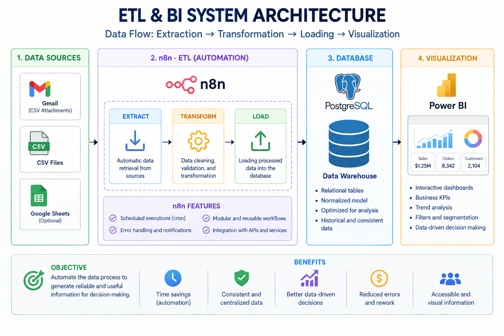

# Automated Business Intelligence ETL Platform

An automated ETL and BI platform that extracts data, processes it with n8n workflows (ETL), stores it in a relational database (PostgreSQL), and visualizes it in Power BI. It simulates a real-world data architecture for business analysis and reporting.

> An end-to-end BI pipeline: automated CSV ingestion from Gmail → JavaScript transformation → UPSERT into PostgreSQL → executive dashboard in Power BI. Zero manual steps.

---

## System Architecture

---

## Project Overview

.png)

---

## Business Problem

A network of Honda motorcycle dealerships across **5 states in India** had no centralized reporting system. Regional managers sent CSV files ad-hoc over email, and one analyst spent ~40 hours/month consolidating them manually in Excel before any analysis could begin.

| Pain Point | Impact |
|---|---|
| Manual CSV consolidation | ~40 analyst hours / month |
| Reporting latency | 3-day lag to executive visibility |
| Duplicate record rate | 15–20% from manual file merging |

Business decisions on inventory, financing promotions, and insurance cross-sell were being made on **₹37.41M in sales** that was 3 days old.

---

## Solution

| Step | Tool | Action |
|---|---|---|
| Trigger | Gmail API / OAuth2 | Detect a new email with a CSV attachment |
| Validate | n8n Filter node | Sender allowlist + subject regex |
| Extract | n8n Extract from File node | Base64 decoding → 1,500+ JSON rows |
| Transform | JavaScript Code node | Null removal, type casting, date normalization |
| Load | PostgreSQL | `INSERT ... ON CONFLICT DO UPDATE` (idempotent) |
| Notify | Gmail | Run summary email (rows inserted / updated / skipped) |

---

## Tech Stack

| Layer | Technology |
|---|---|
| Orchestration | n8n (self-hosted) |
| Source | Gmail API / OAuth2 |
| Transformation | JavaScript |
| Storage | PostgreSQL 15 |
| Visualization | Power BI |
| Infrastructure | Docker Compose |

---

## Database Schema

A star schema with 1 fact table, 3 dimensions, 1 audit table, and semantic-layer views consumed by Power BI.

| Object | Type | Description |
|---|---|---|
| `sales_orders` | Fact | Transaction-level grain — one row per order |
| `dim_products` | Dimension | Motorcycle model catalog |
| `dim_geography` | Dimension | State / region / tier |
| `dim_payment` | Dimension | Payment method metadata |
| `pipeline_runs` | Audit | Every run logged with row counts + status |
| `vw_monthly_kpis` | View | Pre-aggregated KPIs for Power BI |

*The full schema and n8n workflows are available on request.*

---

## Results

| Metric | Before | After |
|---|---|---|
| Analyst hours / month | ~40h | **0h** |
| Reporting latency | 3 days | **< 1 hour** |
| Duplicate rate | 15–20% | **0%** |
| Net sales tracked | Fragmented | **₹37.41M unified** |

---

## Roadmap

| Priority | Feature |
|---|---|
| P1 | dbt transformation layer (staging + mart models) |
| P1 | Pipeline monitoring dashboard on top of `pipeline_runs` |
| P2 | Error handling + dead-letter queue + Slack alerts |
| P2 | Cloud deployment (GCP + Cloud SQL + Power BI Service) |
| P3 | Migration to Snowflake / BigQuery |
